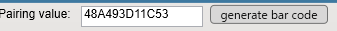
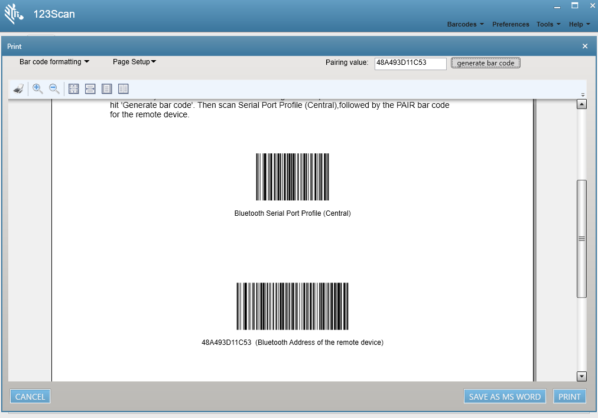
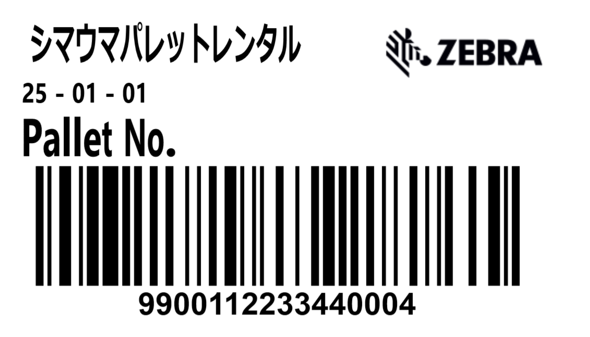

## Label Duplicator
# 「デモ・シリーズ Vol.01」ラベル・デュプリケータ
</br>


</br>

国内外でラベルの複製印刷が必要な現場は多く存在しています。ラベルの複製が必要とされる業務や現場には、以下のようなものがあります：

</br>

|||
|-|-|
| 製造業| 製品の識別や品質管理のために、同じラベルを複数枚印刷して異なる部品や製品に貼付することがあります。
| 物流・倉庫管理| 出荷ラベルや在庫管理ラベルを複製し、異なる梱包や保管場所に貼ることで、追跡や管理を容易にします。
| 食品業界| 賞味期限や成分表示のラベルを複製し、異なるパッケージや商品に貼ることで、消費者への情報提供を統一します。
| 医療・製薬業界| 医薬品や検査サンプルの識別ラベルを複製し、正確な管理やトレーサビリティを確保します。
| 小売業| 商品の価格やバーコードラベルを複製し、異なる店舗や棚に貼ることで、販売管理を効率化します。

</br>

ラベルの複製は、業務の効率化や正確性向上に貢献する重要なプロセスです。

本ページではパレットの認識ラベルを複製印刷するデモをBluetoothスキャナとプリンタのみで実現する方法をお教えします。

</br>

## 想定シーン

パレットの四方には認識ラベルが貼付されています。このラベルは運用中に劣化や破損などが発生し、文字・バーコードが認識できなくなります。このような状態が発生すると業務が中断する恐れが発生するため、視認性の高いラベルの情報を基に複製を印刷します。

</br>

### 必要な機器

本ページではZQ620+とRS5100を前提に説明を進めていきます。

1. Zebra Bluetooth スキャナ
    | Bluetooth central設定ができるもの  
    eg. RS5100, CS6080 など
1. Zebra Link-OS プリンタ  
    | Bluetooth Classic 接続ができるもの
    | 200dpi
1. 3 x 1.75 inch / Black Mark ラベル  
    ※ 後述するDEMO.ZPLの改変で様々なラベルサイズに対応が可能です。

</br>


### 設定（プリンタ）

1. プリンタの印刷・用紙設定をします。

1. プリンタのBluetooth MACアドレスを確認します。
    ```
    ! U1 getvar "bluetooth.short_address"
    ```


1. プリンタのZBI機能をActivateします。  
    https://supportcommunity.zebra.com/s/article/Activating-and-deactivating-ZBI-Zebra-Basic-Interpreter?language=ja

1.  プリンタの設定をします。
    ```
    ! U1 setvar "display.password.level" "none"
    ! U1 setvar "bluetooth.enable" "on"
    ! U1 setvar "bluetooth.discoverable" "on"
    ! U1 setvar "bluetooth.minimum_security_mode" "1"
    ! U1 setvar "media.type" "journal"
    ! U1 setvar "power.inactivity_timeout" "0"
    ! U1 setvar "power.sleep.timeout" "0"
    ! U1 setvar "power.sleep.enable" "off"
    ```

1. プリンタを再起動します。

1. Zebra Setup Utilityなどで下記ファイルをプリンタに送信します。

    - PALLET_ZPL.zpl
    - PALLET_ZBI.prn

1. ZBIのプログラムを実行します。

    ◇ 液晶メニューの場合
    ```
    ツール ＞ ZBI PRGの実行 ＞ PALLET01.BAS ＞ 実行
    ```

    ◇ コマンドの場合
    ```
    ^XA
    ^JIE:PALLET01.BAS,N,N,50K^FS
    ^XZ
    ```

    これで、プリンタ側での準備はできました。

</br>


### 設定（スキャナ）


1. スキャナを初期化しておく。
    ```
    123Scan > Barcodes > Restore Scan Parameters  
    ```

1. スキャナにSuffix (CRLF)設定をする。下記バーコードを順番にスキャンする。

    </br>
    
     </br>

    </br>

    [引用：Enable a Carriage Return/Line Feed (Enter Key) Suffix after Every Scan](https://supportcommunity.zebra.com/s/article/How-dodr-every-scan-with-the-laser-scanners-when-attached-via-USB-or-Keyboard-Wedge?language=en_US)


1. プリンタとペアリングするためのバーコードを作成します。

    ```
    123Scan > Barcodes > SPP (central) paring barcode 
    > "Paring value" にBluetooth MACアドレスを入力 > generate barcode
    ```

    

1. 作成されたバーコードを順番にスキャンします。

    

1. 手順に誤りがなければ、プリンタとスキャナ間でペアリングが成功します。

</br>

### デモ手順

1. スキャナでバーコードをスキャンすると同じデータのラベルが印刷されます。

    

[End]